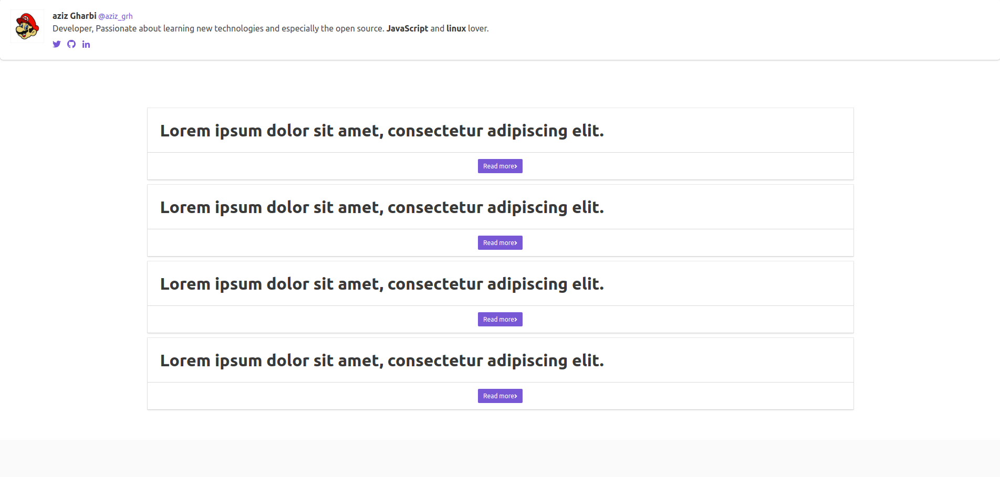
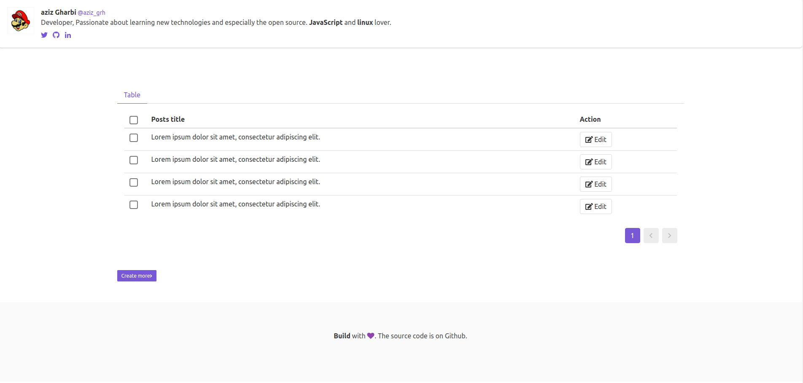

### Blog build with vue-cli using firebase + admin dashboard

* vue-cli (vue-router)
* buefy : [buefy.github.io](https://buefy.github.io/)


### commande to generate your user

```node src/console/register.me.js  example@example.com  password
```







